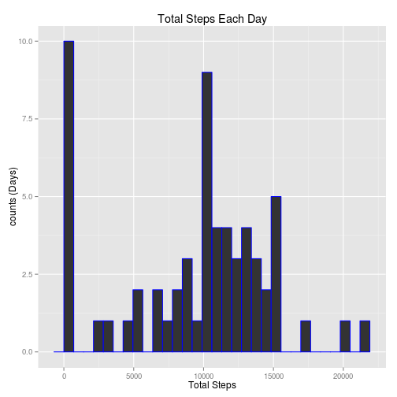
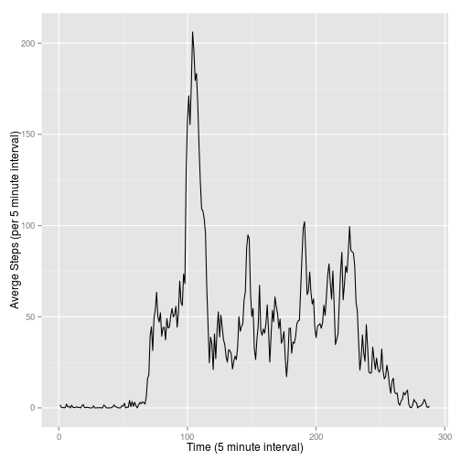
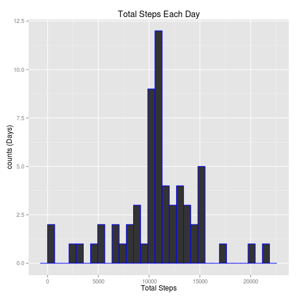
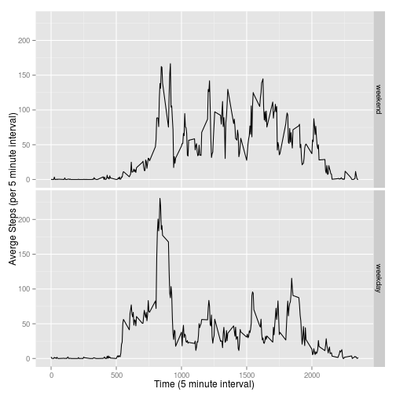

In this analysis, we're going to explore the motion of a person wearing an 
activity monitoring device. This device collects data at 5 minute intervals 
through out the day. The data consists of two months of data from an anonymous 
individual collected during the months of October and November, 2012 and include
the number of steps taken in 5 minute intervals each day.

## Loading and preprocessing the data

Data tables (from the data.table package) are easy to look at, so we'll read the
data into one of those.


```r
library(data.table)
unzip("activity.zip",overwrite=FALSE)
```

```
## Warning in unzip("activity.zip", overwrite = FALSE): not overwriting file
## './activity.csv
```

```r
data <- fread("activity.csv")
```

We'll make the data easier to read and manipulate by setting nicer column names
and changing the dates from character vectors into Date objects.


```r
setnames(data, colnames(data), c("Steps","Date","Interval"))
data$Date <- as.Date(data$Date)
```


## What is mean total number of steps taken per day?

First we find the total steps taken each day.  Some of the days have NA for all
their step values, so they will show up as 0 steps.

```r
days <-aggregate(list(TotalSteps = data$Steps),
                 by=list(Date = data$Date),FUN=sum,na.rm=TRUE)
```

Now let's make a histogram of the total steps per day


```r
library(ggplot2)
qplot(TotalSteps, data = days,ylab="counts (Days)", xlab="Total Steps", 
      main="Total Steps Each Day", color=I("blue"))
```

```
## stat_bin: binwidth defaulted to range/30. Use 'binwidth = x' to adjust this.
```

 

Finally, let's compute the mean and median steps per day.  Note that the days
with a "0" entry for total steps are going to warp the results, so the median
number is probably a bit more reliable as an indicator of "normal" behavior than
the mean number.


```r
meanSteps <- mean(days$TotalSteps)
medianSteps <- median(days$TotalSteps)
```

The mean steps per day is 9354.2295082 and the median steps per day is
10395.

## What is the average daily activity pattern?

Now we're going to look at the activity for each 5-minute interval of the day,
averaged over the full two months.


```r
intervals <-aggregate(list(AverageSteps = data$Steps),
                 by=list(Interval = data$Interval),FUN=mean,na.rm=TRUE)
intervals <- data.table(intervals)
nIntervals <- nrow(intervals)
```

The time intervals are in 24 hour time (0-55,100-155,200-255...), which is not
very convenient for base-10 plotting.  Instead, we'll plot using the index of 
the interval (i.e. 1,2,...288) for the x-axis.


```r
qplot(x=1:nIntervals,y=intervals$AverageSteps,data = intervals, 
      geom="line", xlab="Time (5 minute interval)", 
      ylab="Averge Steps (per 5 minute interval)")
```

 

Let's find the interval with the maximum number of average steps.


```r
maxSteps <- max(intervals$AverageSteps)
maxInterval <- which.max(intervals$AverageSteps)
maxTimeOfDay <- intervals$Interval[maxInterval]
```

The maximum average number of steps was 206.1698113, which occured in interval
number 104.  That translates to a time of day of 835.

## Imputing missing values

There are many intervals that have an empty (NA) entry for steps.  Let's find
those entries and fill them with the average number of steps for that given
time interval (computed above).  Then we can redo some of our earlier 
calculations to try to get more reliable results.

First we'll find the rows that are missing observations.

```r
missingEntries <- is.na(data$Steps)
countMissing <- length(data$Steps[missingEntries])
```

There are 2304 entries missing.

Now let's make a new dataset with the missing rows filled in using the average 
5-minute interval values.

```r
completedData <- merge(data,intervals,by ="Interval")
setorder(completedData,Date,Interval)
completedData$Steps[missingEntries] <- completedData$AverageSteps[missingEntries]
completedData$AverageSteps <- NULL
```

Now we'll redo our earlier analyses of mean and median total steps.


```r
daysComplete <-aggregate(list(TotalSteps = completedData$Steps),
                 by=list(Date = completedData$Date),FUN=sum)
meanStepsComplete <- mean(daysComplete$TotalSteps)
medianStepsComplete <- median(daysComplete$TotalSteps)
```

With all the missing entries filled in, we find that the new mean number of
steps is 1.0766189 &times; 10<sup>4</sup>, and the new median number of steps is
1.0766189 &times; 10<sup>4</sup>.  We see that these are coincidentally the same number,
which would normally be an indication that something might be amise in the 
analysis. But in these circumstances, it is actually reasonable.  The average 
number of steps in a given day is the sum of the average number of steps in each 
time interval.  Because there are several days in the original data set that 
were missing all their entries, those days have been imputed to have the average
number of steps.  The day with the median total steps happens to be one of those
days.

We see that the new median entry is not drastically different from the old one
(a 0.0344773\% difference).  But the new mean
entry differs from the old one by 0.1311475\%, which is
a sizeable change.

Here is a histogram of the total steps each day with missing values imputed:

```r
qplot(TotalSteps, data = daysComplete,ylab="counts (Days)", xlab="Total Steps", 
      main="Total Steps Each Day", color=I("blue"))
```

```
## stat_bin: binwidth defaulted to range/30. Use 'binwidth = x' to adjust this.
```

 

## Are there differences in activity patterns between weekdays and weekends?

Let's see how the activity data differ between weekdays and weekends.  First,
let's add a factor column to completedData that lists Weekday or Weekend as
appropriate.


```r
weekdays <- c("Monday","Tuesday","Wednesday","Thursday","Friday")
completedData$Day <- factor(weekdays(completedData$Date) %in% weekdays, 
                            labels = c("weekend","weekday"))
```

Now lets compute the average steps in each time interval separately for weekends
and weekdays.  Then we'll plot the data next to each other.


```r
intervalsByDay <- with(completedData, aggregate(list(AverageSteps = Steps),
                 by=list(Interval = Interval, Day = Day),FUN=mean,na.rm=TRUE))
intervalsByDay <- data.table(intervalsByDay)

qplot(x=Interval, y=intervalsByDay$AverageSteps,data = intervalsByDay, 
      geom="line", xlab="Time (5 minute interval)", 
      ylab="Averge Steps (per 5 minute interval)", facets = Day ~ .)
```

 

We see that the weekday activity is spiked around 8am (perhaps from a morning 
jog?) and subdued the rest of the week.  In contrast, the weekend days show
sporadic bursts of activity throughout the day.
